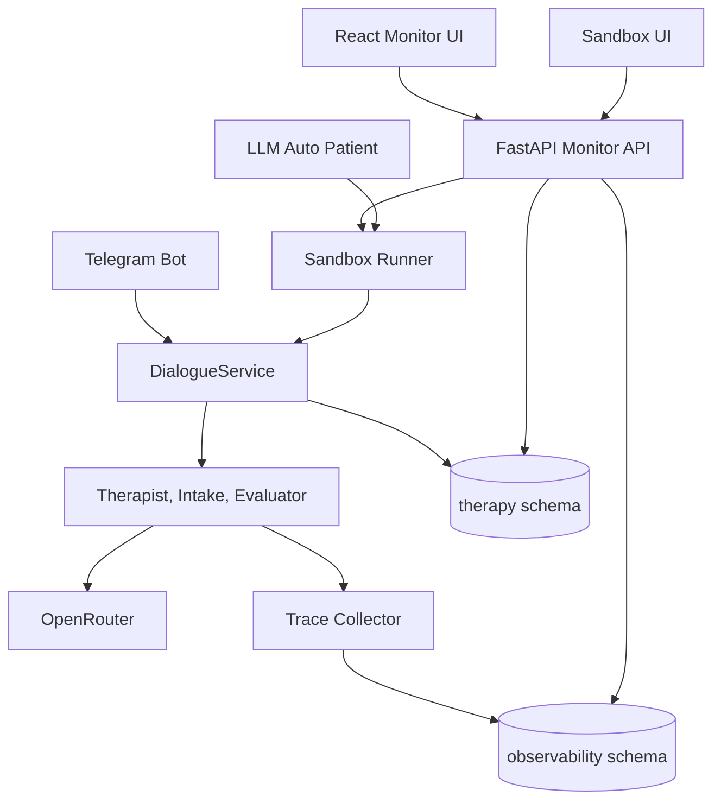

# Opora Monitor and Sandbox: техническое задание

## Назначение

Opora Monitor and Sandbox - отдельная подсистема для разработки, отладки и анализа LLM-диалогов. Она показывает реальные Telegram-чаты и sandbox-прогоны, раскрывает LLM-вызовы, промпты, ответы модели, токены, latency, ошибки и end-to-end время обработки одного хода.

Подсистема не заменяет Telegram-бота. Она запускается отдельным процессом, использует общие доменные сервисы проекта и пишет данные в существующий PostgreSQL.

## Границы ответственности

Входит в подсистему:

- Web UI для просмотра чатов, сообщений, traces и sandbox-диалогов.
- FastAPI backend для чтения данных и запуска sandbox-сценариев.
- Trace-слой для связи одного пользовательского хода с несколькими LLM-вызовами.
- Sandbox runner, который вызывает `DialogueService` без Telegram.
- LLM-автопациент для автоматического тестового диалога.
- Шаблоны автопациента и метрики sandbox-прогонов.

Не входит:

- Замена production Telegram polling.
- Полноценная внешняя observability-платформа.
- Извлечение скрытой chain-of-thought модели, если provider ее не возвращает.
- Публичный доступ без авторизации.

## Архитектура



## Архитектурные решения

### ADR-001: отдельный web-сервис

Status: Accepted

Context: текущий проект является async Telegram-ботом с единственным production entrypoint `bot_runner.py`.

Decision: добавить отдельный FastAPI entrypoint `monitoring.api.main`, а не встраивать HTTP/UI в Telegram polling.

Alternatives:

- Встроить FastAPI в `bot_runner.py`.
- Сделать только CLI/debug scripts.

Consequences:

- Positive: Telegram polling и sandbox не блокируют друг друга; сервис проще деплоить отдельно.
- Negative: появляется второй процесс и новые env-настройки.

### ADR-002: observability schema вместо отдельной БД на первом этапе

Status: Accepted

Context: проект уже хранит `observability.agent_logs`, а сообщения и сессии находятся в `therapy`.

Decision: расширить существующую схему `observability`. Физически отдельную БД оставить как будущий вариант для больших объемов логов.

Trade-off: единая БД сохраняет FK и простые JOIN-запросы, но требует retention/архивации при росте данных.

### ADR-003: универсальный channel/trace слой

Status: Accepted

Decision: каждый пользовательский ход получает `trace_id`, `turn_id`, `channel`, `source`, `account_id`, `session_id`. Telegram, sandbox и будущие каналы используют один формат.

Trade-off: небольшая дополнительная модель данных сейчас снижает риск дублирования логики интеграции.

### ADR-004: reasoning без скрытой chain-of-thought

Status: Accepted

Decision: хранить только provider-visible `reasoning`, `reasoning_summary`, evaluator decisions и metadata. Скрытую chain-of-thought не извлекать и не обещать в UI.

## API contract

Базовый префикс: `/api`.

- `GET /health` - статус web-сервиса.
- `GET /api/chats` - список сессий с фильтрами `source`, `query`, `limit`, `cursor`.
- `GET /api/chats/{session_id}` - карточка чата.
- `GET /api/chats/{session_id}/messages` - сообщения чата.
- `GET /api/chats/{session_id}/traces` - traces по чату.
- `GET /api/traces/{trace_id}` - детальная трасса с LLM calls.
- `POST /api/sandbox/sessions` - создать synthetic session.
- `POST /api/sandbox/sessions/{run_id}/messages` - отправить сообщение как пациент.
- `POST /api/sandbox/sessions/{run_id}/auto-run` - запустить несколько автоматических ходов пациента.
- `POST /api/sandbox/sessions/{run_id}/stop` - остановить sandbox run.
- `GET /api/sandbox/templates/patients` - список шаблонов пациента.

## DB schema

Расширение `observability.agent_logs`:

- `trace_id UUID`
- `turn_id UUID`
- `channel VARCHAR(50)`
- `prompt_messages JSON`
- `reasoning_summary TEXT`
- `cost_usd NUMERIC`
- `provider_metadata JSON`

Новые таблицы:

- `observability.conversation_traces` - end-to-end пользовательский ход.
- `observability.sandbox_runs` - настройки и статус sandbox-прогона.
- `observability.sandbox_turns` - пары patient/assistant в sandbox.
- `observability.patient_templates` - версионируемые шаблоны автопациента.

## Trace lifecycle

1. Канал создает `TraceContext`.
2. `DialogueService` заполняет `account_id` и `session_id`, когда они известны.
3. Каждый LLM-вызов пишет `agent_logs` с текущим trace context.
4. Trace context агрегирует tokens и LLM latency.
5. После ответа создается `conversation_traces` со статусом, duration и totals.

## Sandbox lifecycle

1. UI создает `sandbox_run`.
2. Backend создает synthetic account и therapy session.
3. Пользователь или автопациент отправляет message.
4. `SandboxRunner` вызывает `DialogueService.process_message(..., channel=\"sandbox\")`.
5. Ответ, trace и метрики сохраняются в `sandbox_turns` и `observability`.
6. Run завершается по stop request, max turns или ошибке.

## Patient template format

Шаблон описывает не психолога, а пациента:

- `name`
- `persona`
- `presenting_problem`
- `hidden_facts`
- `emotional_trajectory`
- `cooperation_level`
- `safety_boundaries`
- `max_turns`
- `stop_conditions`

Базовое системное правило: модель отвечает только как пациент, не анализирует систему, не становится терапевтом и раскрывает факты постепенно.

## Безопасность

- `MONITORING_ENABLED=false` по умолчанию для production.
- API защищается `MONITORING_API_TOKEN`.
- Prompt/response считаются чувствительными данными.
- Секреты и `.env` не выводятся в UI.
- Экспорт логов должен проходить через redaction.

## Acceptance criteria

- UI показывает список Telegram и sandbox-чаты.
- Для выбранного чата видны сообщения и LLM timeline.
- Для LLM-вызова видны prompt, response, model, latency, tokens, success/error.
- Sandbox отправляет сообщение без Telegram и получает ответ через реальный `DialogueService`.
- Auto patient может выполнить несколько ходов без ручного ввода.
- Traces связаны с `session_id`, `trace_id`, `turn_id`.
- Alembic миграция проходит.
- Unit/API/integration проверки проходят локально.

## Appendix: LLM config v2

Секреты и публичные LLM-настройки разделены:

- `.env` хранит `OPENROUTER_API_KEY`, `DATABASE_URL`, `TELEGRAM_BOT_TOKEN`, `LLM_CONFIG_PATH`, `MONITORING_*`.
- `config/llm_models.json` хранит публичные модели и гиперпараметры всех ролей.
- По умолчанию все agent tasks используют `google/gemma-4-26b-a4b-it:nitro`.

Роли в JSON:

- `therapist.generate_response`
- `intake.intake_turn`
- `evaluator.evaluate_client_reaction`
- `evaluator.assess_emotion`
- `evaluator.update_response_strategy`
- `evaluator.should_use_memory`
- `evaluator.should_end_session`
- `evaluator.evaluate_therapy_progress`
- `evaluator.determine_treatment_stage`
- `evaluator.select_initial_therapy`
- `sandbox_patient.auto_patient`

`core.llm_config.LlmConfigResolver` строит effective config по формуле:

```text
defaults + agent.task config + sandbox run override + turn override
```

Sandbox UI может менять `model`, `temperature`, `max_tokens`, `top_p`, `frequency_penalty`, `presence_penalty`. Overrides сохраняются в `observability.sandbox_runs.model_config` как effective snapshot и применяются к агентам через runtime context.

## Appendix: trace completeness

Каждый LLM-вызов должен сохранять:

- `generation_params`: фактические параметры генерации;
- `config_source`: `default_config`, `sandbox_run_override` или `turn_override`;
- `prompt_messages`: итоговые provider messages;
- `prompt_variables`: структурированные переменные до рендера prompt;
- `prompt_truncated` и `response_truncated`;
- `provider_metadata`: provider id/model/finish_reason/usage;
- `cost_usd`, если provider возвращает стоимость;
- `trace_id`, `turn_id`, `channel`, `session_id`.

UI trace detail показывает эти данные отдельными секциями: `Generation Params`, `Variables`, `Prompt`, `Response`, `Provider Metadata`. Sandbox turn содержит кликабельный `trace_id`, чтобы перейти к детальному timeline.
